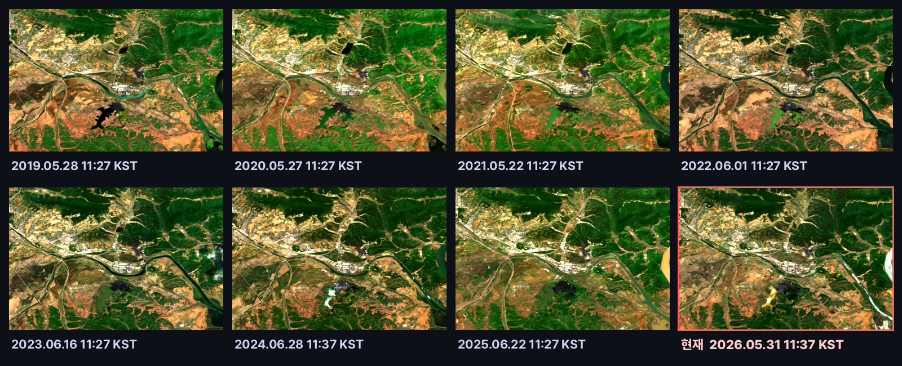
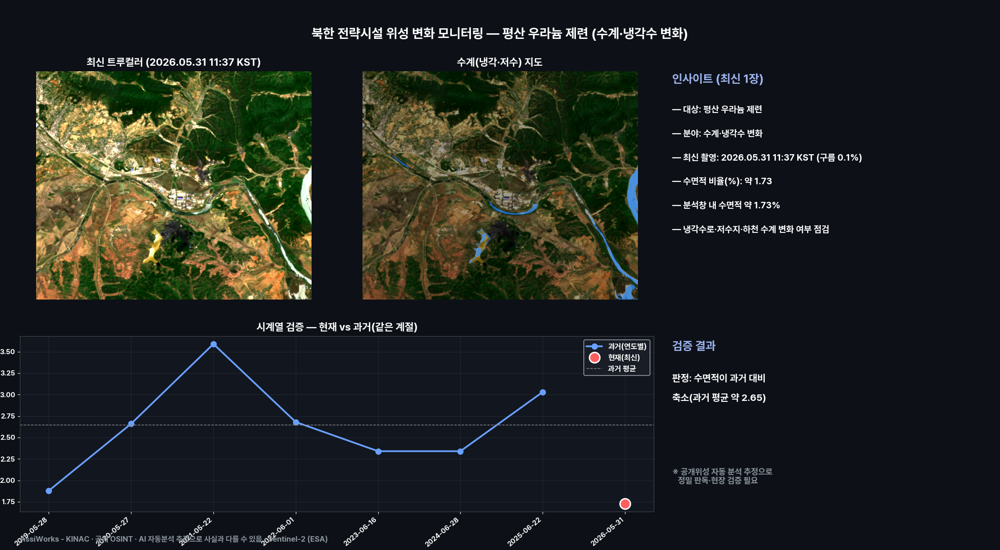
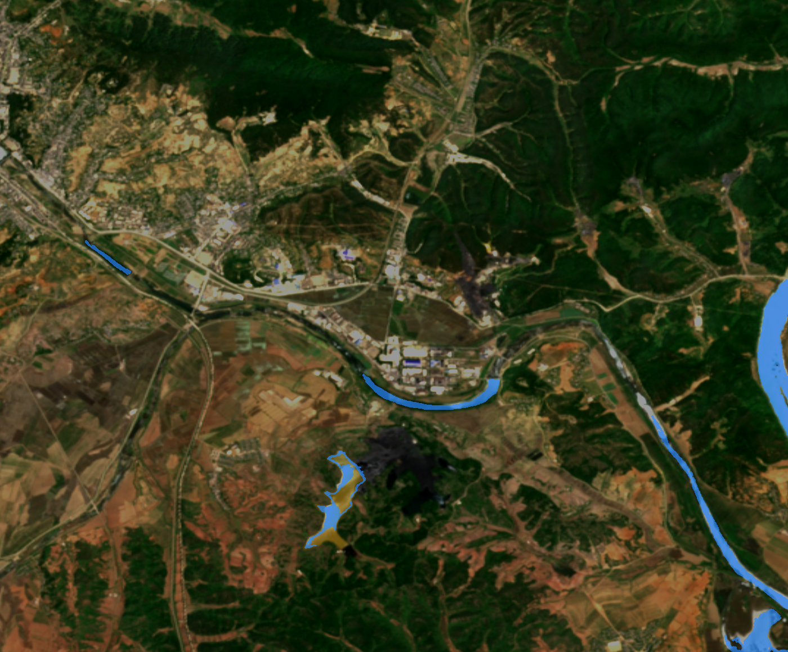
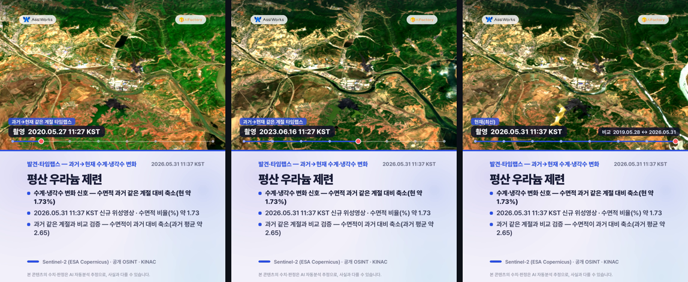
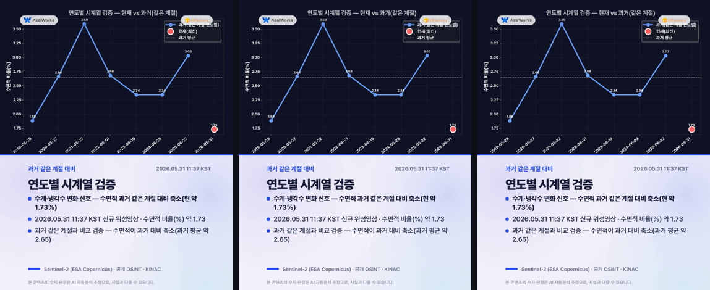
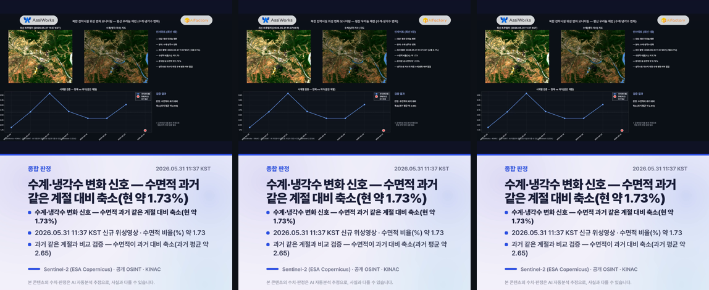

# 북한 전략시설 위성 변화 감지 — 평산 우라늄 제련 (수계·냉각수 변화)

**상태**: 🟠 변화 감지 · **발행**: 2026-06-19 15시 · **분야**: 수계·냉각수 변화 · **센서**: Sentinel-2 L2A (ESA) · 10 m · **공개 OSINT**
**대상 추정**: 평산 우라늄 제련(Pyongsan) · 우라늄 광산·제련(옐로케이크) 추정
**원본 촬영**: 2026.05.31 11:37 KST (구름 0.1%, 신규 위성영상) · **분석창**: 중심 ±2.6km

> ⚠️ **추정치·공개정보 안내**: 본 콘텐츠는 공개된 Sentinel-2(ESA Copernicus) 위성영상을 AI·알고리즘이 자동 분석한 **추정 결과**로, 사실과 다를 수 있습니다. 대상 좌표는 공개 OSINT 참조점이며 정밀 측지값이 아닙니다. 본 자료는 핵 비확산·안전조치 관점의 변화 관찰을 돕는 참고용이며, 특정 군사적 판단·표적화 목적이 아닙니다. 정밀 판독·현장 검증을 대체하지 않습니다.

---

## 핵심 발견
> **수계·냉각수 변화 신호 — 수면적 과거 같은 계절 대비 축소(현 약 1.73%)**

## 1단계 — 발견 (최신 1장)
- 2026.05.31 11:37 KST 촬영 영상이 평산 우라늄 제련 부지에 걸쳐, 분석창 안에서 수계·냉각수 변화(수면적 비율(%))을(를) 분석했습니다.
- 수면적 비율(%): 약 1.73.
- 분석창 내 수면적 약 1.73%
- 냉각수로·저수지·하천 수계 변화 여부 점검

## 2단계 — 시계열 검증 (같은 계절·연도별)
같은 시설의 과거 같은 계절 청천 영상(7개)과 비교해 검증합니다.
- 과거: 05-28 1.88, 05-27 2.66, 05-22 3.59, 06-01 2.68, 06-16 2.34, 06-28 2.34, 06-22 3.03
- 현재: 05-31 약 1.73
- **판정: 수면적이 과거 대비 축소(과거 평균 약 2.65)**
- ※ 공개위성 자동 분석 추정으로 정밀 판독·현장 검증이 필요합니다.

## 과거→현재 같은 계절 영상 (연도별 · 촬영시각 표기)
리포트에서 바로 과거 영상을 확인할 수 있습니다. 각 영상에 촬영 시각(KST)이 표기되며, 빨간 테두리가 현재(최신) 영상입니다.

## 분석 종합 (발견 + 검증)

## 수계(냉각·저수) 지도

## 영상카드 (미리보기)

_아래는 각 영상의 대표 장면입니다. 영상은 링크에서 재생/다운로드._

▶️ [card1_discovery.mp4 영상 보기](videocards/card1_discovery.mp4)

▶️ [card2_timeseries.mp4 영상 보기](videocards/card2_timeseries.mp4)

▶️ [card3_summary.mp4 영상 보기](videocards/card3_summary.mp4)

---
_AssiWorks - KINAC · 2026-06-19 15시 · 공개 OSINT · Sentinel-2 (ESA)_
