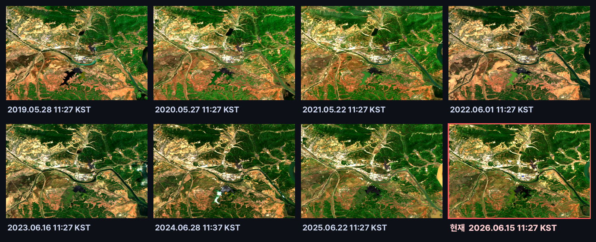
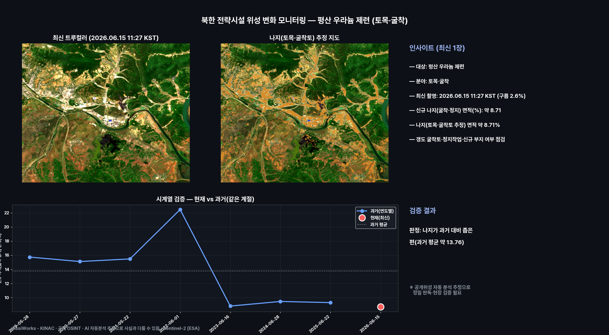
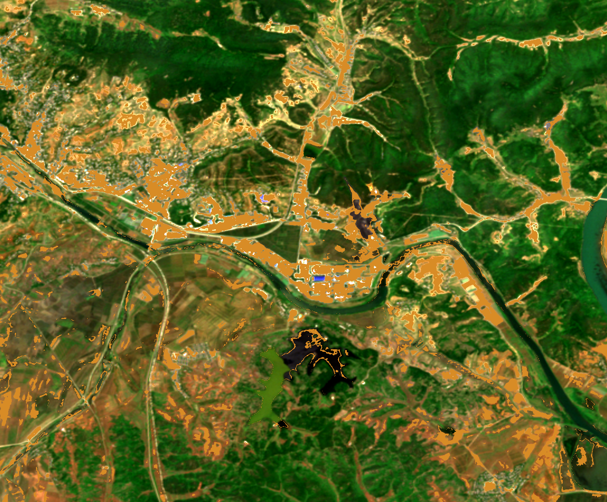
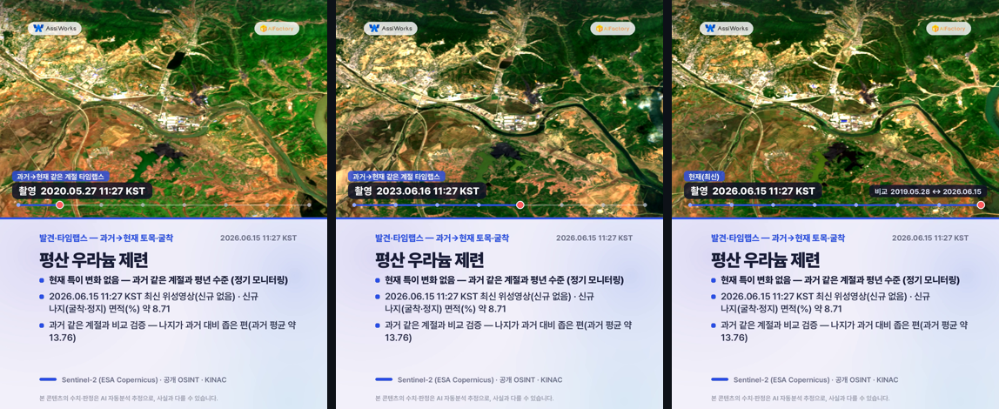
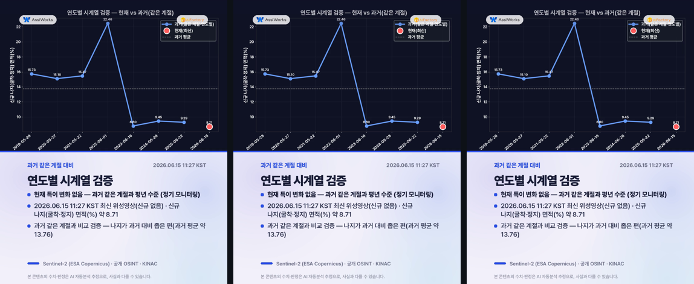
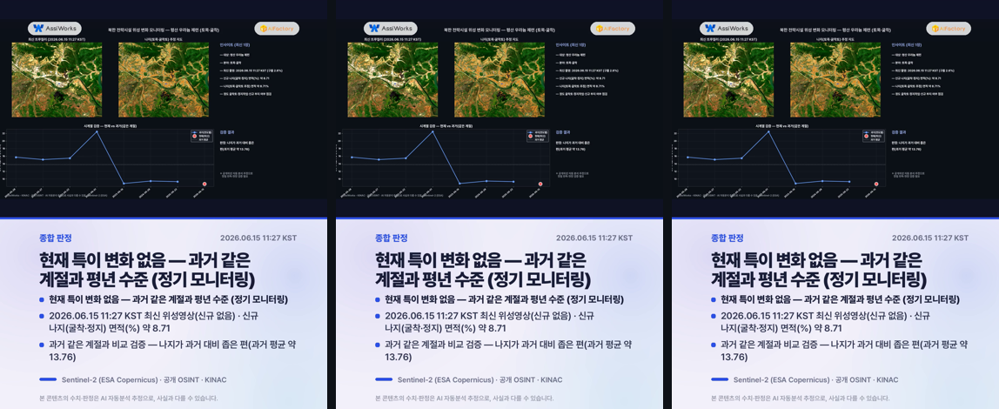

# 북한 전략시설 위성 정기 모니터링 — 평산 우라늄 제련 (토목·굴착)

**상태**: 🟢 평년(특이 변화 없음) · **발행**: 2026-06-22 21시 · **분야**: 토목·굴착 · **센서**: Sentinel-2 L2A (ESA) · 10 m · **공개 OSINT**
**대상 추정**: 평산 우라늄 제련(Pyongsan) · 우라늄 광산·제련(옐로케이크) 추정
**원본 촬영**: 2026.06.15 11:27 KST (구름 2.6%, 최신 위성영상(신규 장면 없어 최신 영상 사용)) · **분석창**: 중심 ±2.6km

> ⚠️ **추정치·공개정보 안내**: 본 콘텐츠는 공개된 Sentinel-2(ESA Copernicus) 위성영상을 AI·알고리즘이 자동 분석한 **추정 결과**로, 사실과 다를 수 있습니다. 대상 좌표는 공개 OSINT 참조점이며 정밀 측지값이 아닙니다. 본 자료는 핵 비확산·안전조치 관점의 변화 관찰을 돕는 참고용이며, 특정 군사적 판단·표적화 목적이 아닙니다. 정밀 판독·현장 검증을 대체하지 않습니다.

---

## 현재 상태
> **현재 특이 변화 없음 — 과거 같은 계절과 평년 수준 (정기 모니터링)**

## 1단계 — 발견 (최신 1장)
- 2026.06.15 11:27 KST 촬영 영상이 평산 우라늄 제련 부지에 걸쳐, 분석창 안에서 토목·굴착(신규 나지(굴착·정지) 면적(%))을(를) 분석했습니다.
- 신규 나지(굴착·정지) 면적(%): 약 8.71.
- 나지(토목·굴착토 추정) 면적 약 8.71%
- 갱도 굴착토·정지작업·신규 부지 여부 점검

## 2단계 — 시계열 검증 (같은 계절·연도별)
같은 시설의 과거 같은 계절 청천 영상(7개)과 비교해 검증합니다.
- 과거: 05-28 15.73, 05-27 15.1, 05-22 15.47, 06-01 22.46, 06-16 8.8, 06-28 9.45, 06-22 9.29
- 현재: 06-15 약 8.71
- **판정: 나지가 과거 대비 좁은 편(과거 평균 약 13.76)**
- ※ 공개위성 자동 분석 추정으로 정밀 판독·현장 검증이 필요합니다.

## 과거→현재 같은 계절 영상 (연도별 · 촬영시각 표기)
리포트에서 바로 과거 영상을 확인할 수 있습니다. 각 영상에 촬영 시각(KST)이 표기되며, 빨간 테두리가 현재(최신) 영상입니다.

## 분석 종합 (발견 + 검증)

## 나지(토목·굴착토) 추정 지도

## 영상카드 (미리보기)

_아래는 각 영상의 대표 장면입니다. 영상은 링크에서 재생/다운로드._

▶️ [card1_discovery.mp4 영상 보기](videocards/card1_discovery.mp4)

▶️ [card2_timeseries.mp4 영상 보기](videocards/card2_timeseries.mp4)

▶️ [card3_summary.mp4 영상 보기](videocards/card3_summary.mp4)

---
_AssiWorks - KINAC · 2026-06-22 21시 · 공개 OSINT · Sentinel-2 (ESA)_
